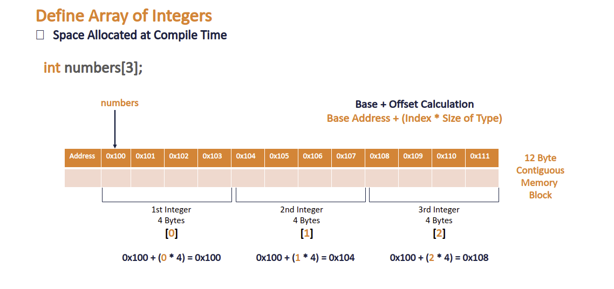
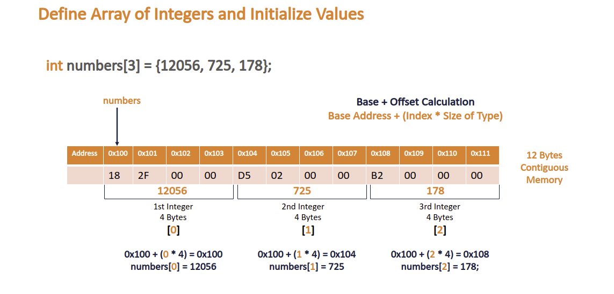
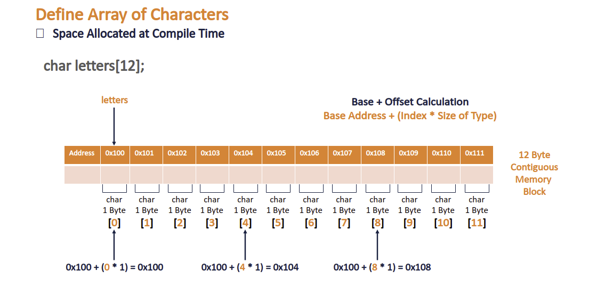
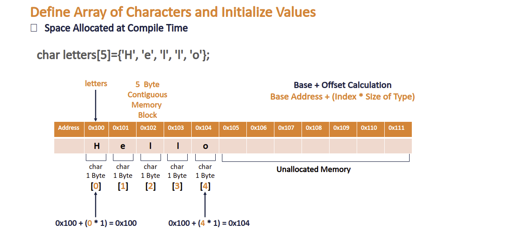
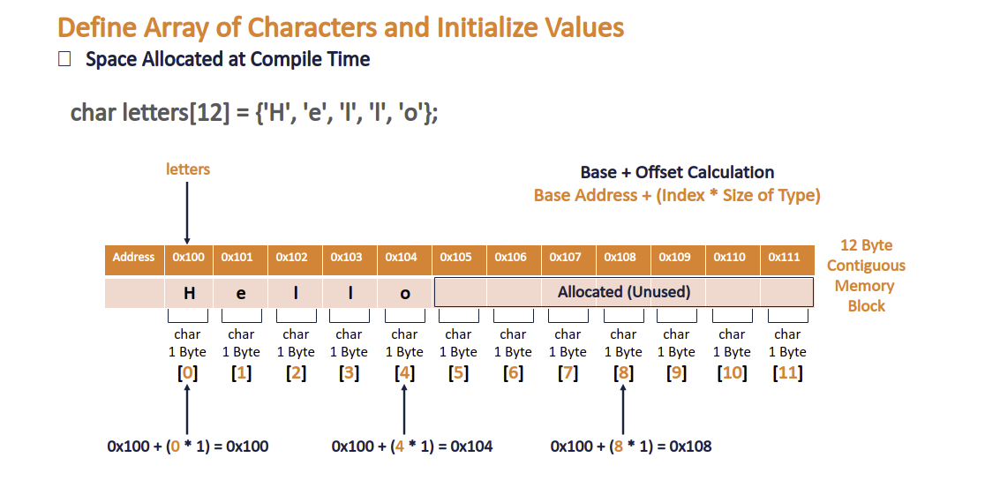

# An Introduction to Arrays in C

## Declare and Integer Array

## Declare and Initialize and Integer Array

## Declare a Character Array

## Declare and Initialize a Character Array and Array Boundary

## Declare and Initialize a Character Array with additional allocated space

